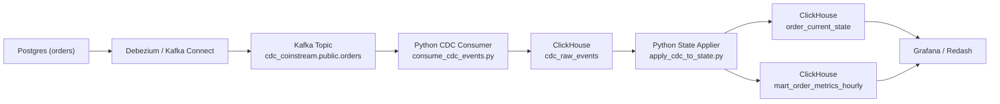

# CDC Architecture

```mermaid
flowchart LR
    A["Postgres (orders)"] --> B["Debezium / Kafka Connect"]
    B --> C["Kafka Topic<br/>cdc_coinstream.public.orders"]
    C --> D["Python CDC Consumer<br/>consume_cdc_events.py"]
    D --> E["ClickHouse<br/>cdc_raw_events"]
    E --> F["Python State Applier<br/>apply_cdc_to_state.py"]
    F --> G["ClickHouse<br/>order_current_state"]
    F --> H["ClickHouse<br/>mart_order_metrics_hourly"]
    G --> I["Grafana / Redash"]
    H --> I
```
